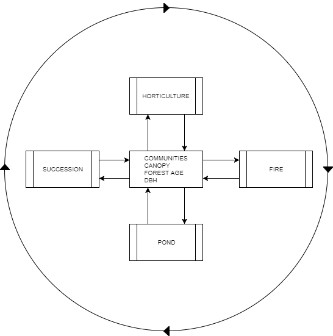

# Historical Disturbance Regimes

scale and frequency of various natural and human disturbances in the North Eastern US [@lorimer_age_1980; @lorimer_scale_2003; @foster_land-use_1998, @pan_age_2011]

Characterization of Native American influence on the landscape [@day_indian_1953; @russell_people_1997; @russell_people_1997; @krech_iii_ecological_1999, @patterson_indian_1988]

# Integrated Disturbances

This script contains three disturbance modules, fire, horticulture and beaver ponds, which can be run individually or in series. All modules use a shared set of inputs; these rasters are updated each time a disturbance processes is invoked and the outputs become inputs for subsequent disturbance modules or the following year.

## Shared Disturbance Inputs
   - (year)_ecocommunities.tif
   - canopy.tif
   - forest_age.tif
   - DBH.tif

# Fire

## Inputs
**Tables**
  - custom_fuel.fmd [2](#myfootnote2)
  - fuel_adjustment.adj [2](#myfootnote2)
  - fuel_moisture.fms [2](#myfootnote2)
  - mannahatta-psdi.txt [2](#myfootnote2)
  - psdi-years.txt [2](#myfootnote2)
  - wtr record [2](#myfootnote2)
  - wind.wnd [2](#myfootnote2)

 **Spatial Data**
  - aspect.asc
  - dem.asc
  - slope.asc
  - canopy.asc
  - fuel.asc
  - fire_trails.tif
  - hunting_sites.tif
  - PROJECT.FPJ [2](#myfootnote2)
  - LANDSCAPE.LCP [2](#myfootnote2)

## Custom Fuel Models

Fuel parameters for hardwood forest types are based on [USFS model 9 (hardwood litter)](https://docs.google.com/spreadsheets/d/1l0hA0Qm5_sujWBDBlpwe_nDqYx2zkpEKaRocAqbOfeM/edit#gid=0), which is used to simulate fires in long leaf pine and hardwood stands, especially oak-hickory types [@scott_standard_2005; @anderson_aids_1982]. Where average loads for 1 hr, 10 hr, and 100 hr fuels were available for northeastern forest types the values were substituted into the custom fuel model [@reinhardt_fire_2015] ([section 4.13.9](https://docs.google.com/spreadsheets/d/1wHe1_AEqAl64A2HmxTpRQQWaDUt3yfcIlARfRiXEagU/edit#gid=0)). The remaining fuel attributes were carried over from the base model. The USFS FIA community types were [cross-walked](https://docs.google.com/spreadsheets/d/1Om3TOY-oGWbXtGUcDXaGulyzVWpZvrNOYYihxpZu9oI/edit#gid=1737952913) to the NY State Heritage community classification so fuels could be assigned for our landscape.

[cross walk table]

## Fuel Moisture Content
Region specific fuel moisture classes were used as start conditions in FARSITE [@reinhardt_fire_2015] (section 4.14.6). All freshwater wetland communities (marshes, shrub-swamps and forested wetlands) were initialized with a wet fuel profile, all other communities with burnable fuel types were initialized with a moist fuel profile.

| Size Class       | Very Dry | Dry | Moist | Wet |
|------------------|---------:|----:|------:|----:|
| 1 hr             |        5 |   7 |    10 |  19 |
| 10 hr            |        8 |   9 |    13 |  29 |
| 100 hr           |       12 |  14 |    17 |  22 |
| Live woody       |       89 | 105 |   135 | 140 |
| Liver herbaceous |       60 |  82 |   116 | 120 |

Table XX. Four predefined moisture values(%) which alter fire intensity and consumption (reproduced from [@reinhardt_fire_2015])

## Initial Conditions - Forest Age

The initial age of forest type communities randomly assigned  using a truncated normal distribution ($\mu=65$ , minimum=0, max=200)[@pan_age_2011; @loewenstein_age_2000]. All other community types were initialized with a forest age of zero.

![Figure. XX Northeast Region (9) age class distribution (reproduced from [@pan_age_2011])](figures/northeast_forest_age_hist.jpg)

## Initial Conditions - Canopy
Communities were initialized with their maximum canopy values as defined in the community table (needs reference/rational).

## fire size and frequency literature
effects of fires on temperate forests [@kozlowski_fire_2012]
power law[@reed_power-law_2002; @cui_what_2008; @stephens_forest_2005]

### Lightning Frequencies
Description of extent and impact of lightning caused forest fires [@loope_human_1998]

The expected frequency ($lambda$) of lighting caused fires are based on areal frequencies from region 9 (U.S. Northeast) USFS wildfire records between 1940  and 2000 [@stephens_forest_2005]. These values were converted from the given units (frequency/400000 ha)/yr to (frequency/km^2^)/yr. 

|  Region  |  Lightning  |            |   Human    |            |
|----------|-------------|------------|------------|------------|
|          | Ha burned   | No. fires  | Ha burned  | No. fires  |
| 9        | 11.840      | 2.170      | 327.990    | 39.950     |

|             |   Lightning    |                |     Human      |                |
|-------------|----------------|----------------|----------------|----------------|
|             | Area burned    | No. Fires      | Area burned    | No. Fires      |
| 1 hectare   | 0.0000296      | 0.000005425    | 0.000819975    | 0.000099875    |
| per km²     | 0.00296        | 0.0005425      | 0.0819975      | 0.0099875      |

### Human Caused Fire and Frequency Scenarios

The extent and effect of human caused fires on the landscape prior to European settlement is debated. Theorized fire regimes range from biannual burns over large areas with a significant impact on under-story structure [@day_indian_1953; @patterson_indian_1988], to frequencies only marginally above lightning caused fires with minimal effect on vegetation structure [@russell_indian-set_1983]. Disagreement stems from the lack of empirical evidence in the ecological record, most observable signs of fire disturbance has been erased by land use change. Because of this our understanding of these processes are primarily based on the historical record. Early travelers during the 16th and 17th century made note of fire as a land management tool in the North Eastern US by Native Americans, but these accounts generally lack quantitative description. Those accounts including estimates of burn frequency are often annual or semi-annual [@russell_indian-set_1983]. We have proposed two frequency scenarios, which bound what we believe are the upper and lower limits of human caused fire disturbance in this region.

Welikia Fire Frequency Scenarios

| source | no human fire | Russell (1983) | Day (1953) |
|--------|---------------|----------------|------------|
| trail  |             0 |            ??? |        ??? |
| garden |             0 |            ??? |        ??? |
| hunting|             0 |            ??? |        ??? |

## Modeling Expected Frequencies
A Poisson distribution is used to model annual forest fire events [@johnson_forest_2001; @yang_spatial_2008]. We created distributions for trail fires, garden fires and lightning fires.

[Fire Frequency Tables](https://docs.google.com/spreadsheets/d/1blQWZPgpWOVH8wdzriO91njUY6qGFU8VxotUYhUHfcs/edit#gid=788358028)

*Ignition Points*

Native Americans used fire for a variety of land management purposes, our model accounts for three potential sources of human caused ignition. Human fires can be started along trails, horticultural sites, and on hunting grounds.

The number of ignitions in a given year is determined randomly using a Poisson distribution for each source . Ignition points can occur on any trail, garden or hunting site pixel that is coincident with a burnable fuel type. Non-burnable fuels include various types of bare-earth and open water. These points are randomly placed on cells that meet the selection criteria.

## Seasonality and Duration and Weather Conditions

*Climate year equivalence*

Each year in the modeled time-frame (1409-1609) has a Palmer's Drought Index derived from (tree ring data??). Using the drought index we select an equivalent climate year between 1876-2006, for which we a have daily weather records [National Weather Service].

weather data is reported with following fields: 

Precipitation: is the daily rain amount specified in hundredths of an inch or millimeters (integer).

Hour1: corresponds to the hour at which the minimum temperature was recorded (0-2400).

Hour2: corresponds to the hour at which the maximum temperature was recorded (0-2400).

Temperatures: (Temp1 is minimum; Temp2 is maximum) are in degrees Fahrenheit or Celsius (integer).

Humidities: (Humid1 is maximum; Humid2 is minimum) are in percent, 0 to 99 (integer).

Elevation: is in feet or meters above sea level. NOTE: these units (feet or meters) do not have to be the same as the landscape elevation theme (integer).

(The wtr files formatted for FARSITE are copied over from the Mannahatta project, I am not aware of any documentation describing the reformatting process or of the original weather data (This data is online at the [National Weather Service Central Park, NY Historical Data](http://www.weather.gov/okx/CentralParkHistorical), but I was only able to find a portal to access daily records for past 2 months, and did not see a way to download many daily records at once. It worth checking to make sure this field has been properly converted and the measurement system header is correct (ENGLISH/METRIC)).

*Duration*

FARSITE requires specific start and end dates for fire events. The disturbance model has a defined window, or *fire season*, in which start dates can be selected. This selection is made randomly from the subset of dates with no precipitation. Historical records suggest that fires typically occurred in the fall and spring. As a default we have defined the start date window occurring between 3/1-5/31, though this can be changed in the disturbance configuration file (FIRE_SEASON_START/FIRE_SEASON_END, scenario_settings.py). The end date of the actual fire simulation is selected by finding the nearest following date in which precipitation exceeds the critical rainfall threshold (CRITICAL_RAINFALL, scenario_settings.py). The end date may extend beyond the end date of the fire season.

*Critical Rainfall*

Modeled fire spread stops when it encounters one of the following conditions: (1) a non-flammable type of land cover; (2) boundaries of the region; and (3) when rainfall exceeded a certain critical amount. We assume that a daily precipitation of 0.10" or more would stop a fire, the R Crit in Eq. (2) was estimated as 0.026 (the proportion of total number of days that has daily precipitation of 30 mm or more) from the historical precipitation data of the Edison weather station. [@li_reconstruction_2000]

## Tree Allometry

|  Description   |         Equation         |        Reference        |
|----------------|--------------------------|-------------------------|
| Tree Height    | $TH = 44 * ln(Age) - 93$ | [@bean_using_2008]      |
| DBH            | $DBH=(Age-34.44)/1.18$   | [@loewenstein_age_2000] |
| Crown Ratio    | $CR = 0.4$               | [@bean_using_2008]      |
| Bark Thickness | $BT = vsp * DBH$         | [@reinhardt_fire_2015]  |

### Communities to Bark Thickness

Bark thickness multipliers for each community are based on the dominant tree type (Edinger et al. 2014), for communities with co-dominate species we calculated average bark thickness [@reinhardt_fire_2015]([section 4.13.4]()).

| community                            | dominant tree species                     | vsp scaler  |
| ------------------------------------ | ----------------------------------------- | ----------: |
| Floodplain forest                    | avg(sliver maple, sycamore, American elm) | 0.032       |
| Red Maple Hardwood Swamp             | red maple                                 | 0.028       |
| Coastal Plain Atlantic Cedar Swamp   | Atlantic cedar                            | 0.025       |
| Pitch pine - scrub oak barrens       | avg( pitch pine, oak spp )                | 0.045       |
| Chestnut oak forest                  | avg( American chestnut, oak spp )         | 0.043       |
| Coastal oak beech forest             | avg( oak spp, beech )                     | 0.035       |
| Coastal oak hickory forest           | avg( oak spp, hickory spp )               | 0.045       |
| Oak tulip forest                     | avg( oak spp, yellow-poplar )             | 0.038       |
| Appalachian oak pine forest          | avg( oak spp, pine spp )                  | 0.038       |
| Hemlock northern hardwood forest     | hemlock                                   | 0.045       |
| Inland Atlantic Cedar Swamp          | Atlantic white cedar                      | 0.025       |
| Red maple black gum swamp            | avg( red maple, black gum )               | 0.034       |
| Red maple sweetgum swamp             | avg( red maple, sweetgum )                | 0.032       |
| Maritime holly forest                | holly                                     | 0.042       |
| Post oak black jack oak barrens      | post oak                                  | 0.044       |
| Appalachian oak hickory forest       | avg( oak spp, hickory spp )               | 0.045       |
| Beech maple mesic forest             | avg( beech, sugar maple )                 | 0.029       |
| Successional maritime hardwoods      | other hardwoods                           | 0.044       |
| Successional hardwood forest         | other hardwoods                           | 0.044       |

## Fire Mortality Equations

*Scorch Height*

**[1]**      $$SH = 3.1817(FL^{1.4503})$$
[@bean_using_2008]

*Crown Kill*

**[2]**      $$CK= 41.961( 100(\ln({SH -CH) \over CL})) - 89.721$$
[@bean_using_2008]

*Percent Mortality*

**[3]**      $$P_{m}= {1.0 \over 1.0 + e^{-1.941 + 6.316(1.0-e^{-BT}) - 0.000535 CK^2}}$$
[@bean_using_2008]

# Horticulture

## Inputs
  **Tables**
  - welikia_lc_reclass.txt
  - proximity_reclass.txt

  **Spatial Data**
  - garden_sites.shp
  - proximity_suitability.tif
  - slope_suitability.tif

## Archaeological Evidence for Gardening
Archaeological evidence suggests the American Indian people living in the Hudson Estuary region practiced horticulture and relied partially on domesticated fruit and vegetable to supplement foraged/hunted foods [@kraft_lenape-delaware_2001, @cantwell_unearthing_2001, @benison_horticulture_1997].

## Ethnohistorical
[@ascher_henry_1860, @danckaerts_journal_1867]

## Site Selection
Horticultural fields were modeled at historical sites meeting the following two criteria.

1. historical and archaeological records provide evidence for semi-permanent habitation.
2. site point is located within 250 m of freshwater source

Garden locations are then selected using a suitability model which takes into account proximity to the site center, slope and community type.

## Field Size

| crop                         | yield (kg/ha)   | calories/100 g   | calories/kg | calories/ha   |
| ---------------------------- | --------------: | ---------------: | ----------: | ------------: |
| corn                         | 1720            | 365              | 3650        | 6278000       |
| beans (Phaseolus vulgaris)   | 110             | 33               | 330         | 36300         |
| squash (Indian squash)       | 80              | 16               | 160         | 12800         |

Corn-bean-squash poly-culture yields in Tabasco, Mexico (reproduced from [@gliessman_agroecology:_1998] pg 224 table 15.3)

Caloric density of corn beans and squash crops prepared by boiling is reported from the USDA Basic Reports Agricultural Research Services.

See Speth 1983 for discussion of caloric requirements and diet in temperate hunter gather societies [@speth_energy_1983]

*Agricultural Dependency Scenarios*

| Dependency     | calories/person/yr    | ha/person    | m^2^/person    |
| :------------: | --------------------: | -----------: | -------------: |
| 15%            | 94060.50              | 0.01         | 14.87          |
| 30%            | 188121.00             | 0.03         | 29.73          |
| 60%            | 376242.00             | 0.06         | 59.47          |
| 100%           | 627070.00             | 0.10         | 99.11          |

[Complete Horticulture Tables](https://docs.google.com/spreadsheets/d/1QBj36_vKr6dFH-fk4eLuFnM5mQPZxpn7C4c1p_E3P_0/edit#gid=0)

[*Create Garden Method*](https://github.com/WildlifeConservationSocietyCI/WelikiaDisturbance/blob/master/garden.py#L216) 

When a new garden is created a starting cell is selected randomly from the set of cells within 500 m of the site that have the highest suitability index. Adjacent cells with the highest suitability are iteratively added in groups around the center. When adding a group of cells would cause the garden to exceed the target area, single cells are added instead, again, choosing cells with highest suitability.

The target area of a new garden is calculated using the population at the site. Each time a new garden is created a value of between -5 and 5 is added to the base number of individuals at the site (which does not change overtime), representing changes in population size and introducing variation in the garden size over the course of the disturbance simulation (see the POPULATION_VARIANCE parameter in scenario_settings.py). 

# Beaver Ponds

## Inputs
  **Spatial Data**
  - dem.tif [1](#myfootnote1)
  - flow_direction.tif [1](#myfootnote1)
  - stream_suitability.tif [1](#myfootnote1)

## Beaver Populations and Disturbance in the North Eastern United States

## Site Selection

*Model Parameters*

| Parameter      | Value     |                | Source                                        |
| -------------- | --------: | :------------- | --------------------------------------------- |
| abandonment P  | 0.10      |                | [@logofet_succession_2016]                    |
| colony density | 0.4       | colonies/km^2^ | [@naiman_alteration_1988]                     |
| territory      | 1000      | m              | @naiman_alteration_1988; @allen_habitat_1983] |

[*Create Pond Method*](https://github.com/WildlifeConservationSocietyCI/WelikiaDisturbance/blob/master/pond.py#L121)

New dam points can only added along mapped streams with a slope of less than 8 degrees, and must be located outside a minimum distance buffer (MINIMUM_DISTANCE, scenario_settings.py) from all existing colonies.

The dam point is an input for the [Arc GIS watershed tool](http://pro.arcgis.com/en/pro-app/tool-reference/spatial-analyst/how-watershed-works.htm), which returns the upstream area that drains into that point. Next, the dam height parameter (DAM_HEIGHT, scenario_settings.py) is added to the elevation at the dam point, all cells in the watershed which have a value lower than the dam height are converted to pond. 
Watershed and dam hight

*Potential for errors and artifacts*
The shape of beaver ponds is determined by the elevation model. Interpolation artifacts, particularly in areas where there information about the topography was limited and in very flat areas, will produce unrealistic pond geometries.  

## Wetland Successional Pathways

The freshwater wetland succession sequence has four stages[@allen_habitat_1983; @hay_succession_2010; @johnston_use_1990; @logofet_succession_2016; @naiman_alteration_1988; @_ecology_1993].

$$\mbox{active beaver pond} \rightarrow \mbox{emergent marsh} \rightarrow \mbox{shrub swamp} \rightarrow \mbox{forested wetland}$$

Conversion from non-wetland community to active pond can occur along any perennial streams where the gradient of the stream is equal to or less than 8 degrees [@allen_habitat_1983]. Due to the temporal scale of our study (200 yrs), forested wetlands are treated as a terminal community in this series [@_ecology_1993]. This rule defines beaver caused disturbance as a one directional change in successional trajectory; A non-wetland community can be converted into a wetland type, but once converted cannot be returned to an upland type.

# Analysis
time since fire [@johnson_forest_2001]
fire size frequency hist [@reed_power-law_2002; @cui_what_2008;@malamud_forest_1998]

# References
